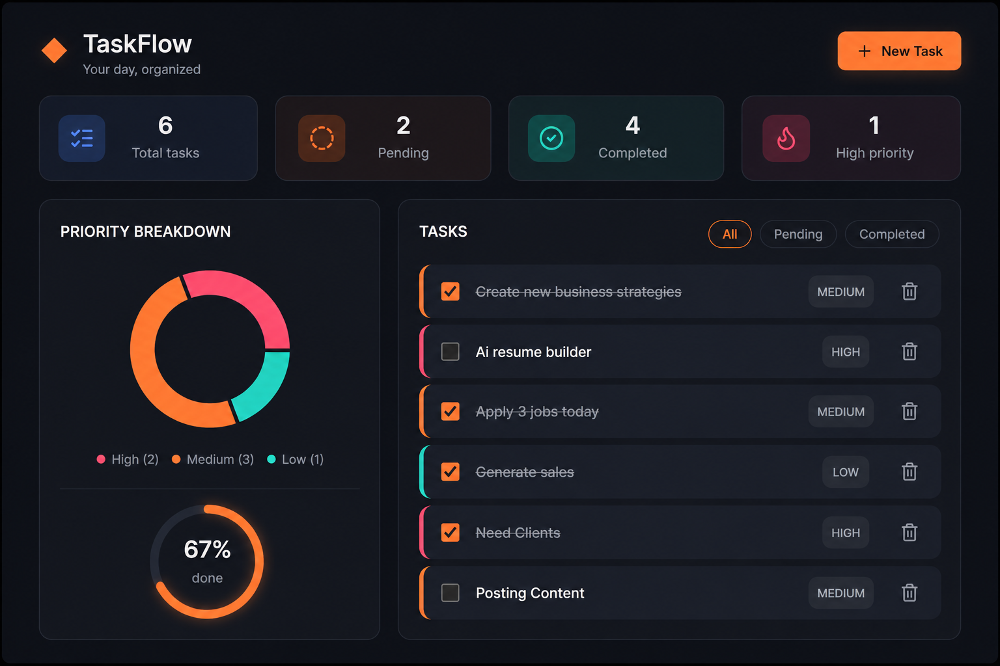

# DoIt Taskflow

**A full-stack task manager — organize, prioritize, and track your work in real time.**

---

A full-stack task management application built with MongoDB, Express, React, and Node.js. Users can create, filter, complete, and delete tasks with priority levels.

## Features

- Create tasks with title and priority (low / medium / high)
- Mark tasks complete / incomplete
- Filter by all / pending / completed
- Delete tasks
- REST API built with Express + Mongoose
- Responsive React UI (Vite)

## Tech Stack

- **Frontend:** React (Vite), Axios
- **Backend:** Node.js, Express
- **Database:** MongoDB (Mongoose)

## Project Structure

\`\`\`
doit/
├── backend/
│   ├── models/Task.js
│   ├── routes/tasks.js
│   ├── server.js
│   └── package.json
└── frontend/
    ├── src/App.jsx
    ├── src/App.css
    └── package.json
\`\`\`

## Getting Started

### Backend

\`\`\`bash
cd backend
npm install
cp .env.example .env   # set your MongoDB connection string
npm start
\`\`\`

Runs on `http://localhost:5000`.

### Frontend

\`\`\`bash
cd frontend
npm install
npm run dev
\`\`\`

Runs on `http://localhost:5173`.

## API Endpoints

| Method | Endpoint          | Description        |
|--------|-------------------|---------------------|
| GET    | /api/tasks        | Get all tasks       |
| GET    | /api/tasks/:id     | Get a single task   |
| POST   | /api/tasks        | Create a new task   |
| PUT    | /api/tasks/:id     | Update a task       |
| DELETE | /api/tasks/:id     | Delete a task       |

## Author

Areeba Afzal